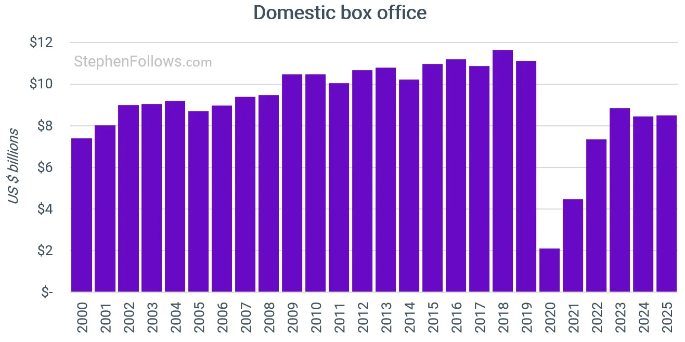

# Business Context, Disney Case (Movie Industry Sub Assignment)

## 1. Introduction
The movie industry is a market with extremely high uncertainty (Hennig-Thurau et al., 2006; Gmerek, 2015). Studios invest large amounts upfront in development, production, and marketing, while real success only becomes visible after release. This makes film projects a typical portfolio problem: as a studio, you must manage multiple films at the same time, spread risk, and continuously improve decision-making to increase the chance of hits and reduce the chance of flops (Gmerek, 2015; Hennig-Thurau et al., 2006).

We approach this case as if we work for **Disney**, a studio that releases both major blockbusters and broader catalog content. In such an environment, it is essential to collect data in a structured way about movies, market reception, and revenues. The goal in this course is not to perform heavy data analysis yet, but to build a reliable database that can support analysis and visualization later.

_These are 2 graphics of another company, who did the research about the box office sales._

---

## 1.1 Industry uncertainty in Hollywood and the urgency of data-driven decision-making
Hollywood is currently in a period of structural uncertainty: theatrical demand has become fragile, streaming disrupts traditional windowing strategies, and technological and financial risks are increasing. This uncertainty is not only industry narrative, it is also supported by research on the film business, streaming, and AI, which together suggest that studios such as Disney increasingly depend on data-driven decision-making. 

First, the global film industry is characterized by high volatility and strong dependence on a small number of hits, where box office revenues follow an extremely skewed, blockbuster-driven distribution, making forecasts inherently unreliable (De Vany & Walls, 1999). This increases risk when production and marketing budgets rise, because profitability thresholds become harder to reach (Teti, 2013; Sacco & Teti, 2020). 

Second, studies on release and windowing strategies show that shortened and/or broken theatrical exclusivity can reduce theatrical revenues and increase dependence on strong opening-week performance (Seifert et al., 2022; Brennan et al., 2024; Chiang & Jhang-Li, 2020). 

Third, streaming platforms increasingly rely on advanced analytics as a core part of their value logic, while traditional studios historically depended more on box office signals and therefore must catch up in data-driven capability (Hadida et al., 2020; Ma, 2025). At the same time, large streamers often disclose viewing metrics selectively, creating data opacity and making benchmarking more difficult compared with public box office figures (Wayne, 2021; Wayne & Uribe Sandoval, 2021). 

Fourth, international markets add volatility: research on the US and China indicates that economic shocks and shifting audience preferences can make markets diverge, and China has become less predictable for foreign, including Hollywood, titles (Li & Liu, 2022; Yin, 2025; Chiu et al., 2019). 

Finally, AI and big-data applications are transforming production, distribution, and marketing, but also introduce new legal and ethical uncertainty around copyright, data power, and the position of talent (Gil, Ravid, & Sorenson, 2025; Ma, 2025). Taken together, these developments make it urgent for Disney to build a reliable data foundation that links movie attributes, market reception signals, and financial outcomes.

---

## 2. Disney's Business Problem
Disney wants to better support decisions about:

- Which movies are most likely to achieve high box office performance, worldwide and by region
- Which movie characteristics are associated with success, such as genre, rating, runtime, cast, and director
- How market perception (expert reviews and customer reviews) relates to performance, and how this differs between movies

This matters because box office revenue affects not only direct income, but also follow-up decisions such as marketing budgets, release timing, distribution across countries, and investment choices for sequels and franchises.

---

## 3. Business Question and Scope

### Business question
**Which factors are associated with box office success of movies, and how can Disney use this information in a structured way to improve portfolio and release decisions?**

### Scope within this course
This course focuses primarily on **Online Data Mining** and **scraping systems**. Therefore, in this project we mainly deliver:

- A repeatable data collection system
- An ERD and database structure that fits the data we scrape
- A dataset that is immediately usable for later data visualization and analysis

We intentionally do not perform extensive modeling or dashboards in this course, because that fits better in the next block focused on data visualization.

---

## 4. What Research Says About Determinants of Movie Success
Scientific research on box office success is broad, but many studies return to a similar logic: movie outcomes are explained by a combination of **product characteristics**, **distribution and timing**, and **information signals** from the market such as reviews and word of mouth. This is often summarized in three blocks:

- Product attributes
- Distribution-related variables
- Information sources

### 4.1 Product characteristics
Product characteristics include elements that are largely fixed before release:

- Genre and target audience
- Age classification and content rating
- Cast and director (star power and director power)
- Runtime
- Franchise-type characteristics

Research suggests that these characteristics are often connected to marketing strategy and audience reach. For example, higher production costs are frequently linked to decisions that reduce risk, such as using well-known talent and stronger promotion.

### 4.2 Distribution and timing
Distribution and timing influence demand and the competitive environment:

- Release timing (for example seasons with higher cinema demand)
- Competition from other releases
- Availability across countries

We cannot fully scrape every distribution factor within the scope of this course, but the key point is that timing and context often play a role in performance and remain interesting directions for later extension.

### 4.3 Reviews and word of mouth as a market signal
A large stream of research studies the effect of reviews and word of mouth on box office.

**Expert reviews (critics)**  
Critic reviews can have a predictive role (critics identify quality) and also an influencing role (reviews shape consumer behavior). Classic research explicitly addresses this and shows that critic reviews relate to box office outcomes, and that effects can differ depending on factors such as budget and star presence.

**Customer reviews and online word of mouth**  
Online word of mouth is highly dynamic around prerelease and the opening week. Research shows that word of mouth activity often peaks around release, and that both volume and sentiment can relate to box office performance.

In addition, there is evidence for a feedback mechanism: stronger box office can increase word of mouth volume, and more word of mouth can further strengthen box office.

These insights provide a clear reason why Disney needs more than just revenue data. Reviews are measurable signals of market response and can help explain performance and later support prediction.

---

## 5. Translation to Our Data Model: Four Core Tables
Based on course feedback, we focus on four core tables. These tables align directly with the research blocks above.

### A) `movies` (product characteristics)
This table contains the core of each movie: title, year, genres, rating, and important metadata such as cast and director where available. This becomes the basis for later feature engineering and visualization.

### B) `sales` (outcome, box office performance)
Box office is the main success measure in our case. Therefore we collect sales, including splits such as domestic, international, and worldwide totals where available. This becomes the target variable for later analysis.

### C) `expertreviews` (critics)
Critic reviews provide an expert quality signal and, according to research, can be predictive and/or influencing. Therefore we store critic scores, publication, and date, so that we can later visualize how critic reception relates to sales.

### D) `customerreviews` (audience and word of mouth)
User reviews represent online word of mouth. Research shows that this relates strongly to box office and can involve a feedback mechanism. Therefore we store user scores, review texts, and dates.

Text is important because sentiment analysis or topic modeling can be done later, but the raw foundation must already exist now.

---

## 6. Why Our Sources Make Sense (IMDb, Metacritic, Box Office Mojo)
- **IMDb** is strong for movie metadata and large volumes of user reviews
- **Metacritic** is strong for critic reviews and score aggregation, plus user scores
- **Box Office Mojo** is strong for box office results and key financial outcomes
- **Rotten Tomatoes** has strong user & expert reviews.

Together, these sources support exactly the categories that appear repeatedly in the literature: product characteristics, market reception signals, and sales.

---

## 7. Practical Value for Disney (Without Heavy Analysis Yet)
With this database, Disney can later:

- Visualize which genres or ratings tend to produce higher worldwide revenue
- Compare relationships between critic scores, user scores, and box office
- Explore release-related patterns using review volume and review timing
- Build a first predictive model to support greenlighting decisions

In this course, our focus is the foundation: scraping, storing, consistent modeling, and making the process reproducible.

---

## 8. Conclusion
In summary, we build a data-driven foundation for Disney. Research indicates that box office success is related to product characteristics, distribution context, and especially reviews and word of mouth. Therefore we systematically collect movie data, sales data, expert reviews, and customer reviews in one database. This enables later steps, including visualization and analysis, that can support Disney in improving portfolio decisions, release strategy, and marketing allocation.

## 9. Reference list (APA 7th edition)
References
Brennan, D., Maclean, K. D. S., & Sanchez, M. (2024). Beyond the big screen: secondary channel releases and their impact on the theatrical market. Journal of Cultural Economics, 49(2), 257–280. https://doi.org/10.1007/s10824-024-09522-0
Chiang, I. R., & Jhang‐Li, J. (2020). Competition through Exclusivity in Digital Content Distribution. Production and Operations Management, 29(5), 1270–1286. https://doi.org/10.1111/poms.13156
Chiu, Y., Chen, K., Wang, J., & Hsu, Y. (2019). The impact of online movie word-of-mouth on consumer choice. International Marketing Review, 36(6), 996–1025. https://doi.org/10.1108/imr-06-2018-0190
De Vany, A., & Walls, W. D. (1999). Uncertainty in the movie industry: Does star power reduce the terror of the box office? Journal of Cultural Economics, 23(4), 285–318. https://doi.org/10.1023/a:1007608125988
Follows, S. (2026, January 5). Why the film business is considerably riskier than it used to be. StephenFollows.com - Using data to explain the film industry. https://stephenfollows.com/p/why-the-film-business-is-considerably-riskier
Gil, R., Ravid, S. A., & Sorenson, O. (2025). Talent and technology in creative industries: introduction to the special issue. Journal of Cultural Economics, 49(2), 241–255. https://doi.org/10.1007/s10824-025-09543-3
Gmerek, N. (2015). The determinants of Polish movies’ box office performance in Poland. Journal of Marketing and Consumer Behaviour in Emerging Markets, 1(1), 15–35. https://doi.org/10.7172/2449-6634.jmcbem.2015.1.2
Hadida, A. L., Lampel, J., Walls, W. D., & Joshi, A. (2020). Hollywood studio filmmaking in the age of Netflix: a tale of two institutional logics. Journal of Cultural Economics, 45(2), 213–238. https://doi.org/10.1007/s10824-020-09379-z
Hennig-Thurau, T., Houston, M. B., & Walsh, G. (2006). Determinants of Motion Picture Box Office and Profitability: An interrelationship approach. Review of Managerial Science. https://www.marketingcenter.de/sites/mcm/files/downloads/research/lmm/literature/hennig-thurau_et_al._2007_rms_determinants_of_motion_picture_box_office_and_profitability_an_interrelationship_approach.pdf
Li, D., & Liu, Z. (2022). Predicting Box-Office Markets with Machine Learning Methods. Entropy, 24(5), 711. https://doi.org/10.3390/e24050711
Ma, D. (2025). Big Data-Driven ecosystem integration in the film and television industry. Information Resources Management Journal, 38(1), 1–22. https://doi.org/10.4018/irmj.388907
Sacco, P. L., & Teti, E. (2020). Maintaining content innovation in an industry with unpredictable returns: a portfolio approach to movie production. Economics of Innovation and New Technology, 30(8), 767–785. https://doi.org/10.1080/10438599.2020.1776502
Sanchez, D. B. &. K. D. S. M. &. M. (2025). Beyond the big screen: secondary channel releases and their impact on the theatrical market. ideas.repec.org. https://ideas.repec.org/a/kap/jculte/v49y2025i2d10.1007_s10824-024-09522-0.html
Seifert, R., Otten, C., Clement, M., Albers, S., & Kleinen, O. (2022). Exclusivity strategies for digital products across digital and physical markets. Journal of the Academy of Marketing Science, 51(2), 245–265. https://doi.org/10.1007/s11747-022-00897-0
Tay, B. (2025). AUDIENCE CULTURE AND TV SERIES: NETFLIX AS a POPULAR CULTURAL PRACTICE. www.academia.edu. https://www.academia.edu/93321262/AUDIENCE_CULTURE_AND_TV_SERIES_NETFLIX_AS_A_POPULAR_CULTURAL_PRACTICE
Teti, E. (2013). The dark side of the movie. The difficult balance between risk and return. Management Decision, 51(4), 730–741. https://doi.org/10.1108/00251741311326536
Wayne, M. L., & Sandoval, A. C. U. (2021). Netflix original series, global audiences and discourses of streaming success. Critical Studies in Television the International Journal of Television Studies, 18(1), 81–100. https://doi.org/10.1177/17496020211037259
Yin, Q. (2025). Using statistical methods to analyze the impact of economic recession on the film industry in China and the United States. Advances in Economics Management and Political Sciences, 196(1), 14–22. https://doi.org/10.54254/2754-1169/2025.bj24758
